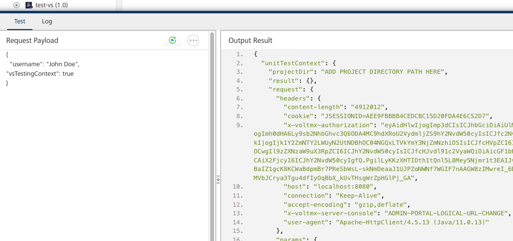

# Write testable code

The recommended approach for unit testing your code is to write the code in a VoltScript Library Module instead (e.g. libs/functions.vss) and call that. You will then be able to write a unit test that:

- Calls `extractObjects()` passing a contextual JSON string (see below).
- Runs your custom function.
- Runs your unit tests against the Volt MX objects.

## Retrieve sample input

You can retrieve a sample JSON string by testing the operation on Volt MX Foundry. Pass `"vsTestingContext": true` in the request's JSON object. The response will then be a JSON object with `unitTestContext`, which will contain the JSON object to use in your unit tests.

For a preprocessor / postprocessor you can call `VoltMxResult.echoUnitTestContext()` to get the `unitTestContext` object.

## Run local test

If the VoltScript runtime is started with the HTTP server (using `--http-server` option), you can also run the VoltScript script from Postman. The URL should be:

- `http://localhost:9060/run`, where the port maps to the HTTP port VoltScript runtime's http server is started with. Port 9060 is the default.
- `?path=` plus the absolute path to the .vss file to run.
- `&seti_path=` plus the absolute path to the seti.ini file to use.

The Content-Type header should be set to "application/json". The body should contain a JSON object, which you can retrieve by testing the operation on Volt MX Foundry. Pass `"vsTestingContext": true` in the request's JSON object. The response will then be a JSON object with `httpServerContext`, which will contain the JSON object to pass in Postman.

For a preprocessor / postprocessor you can call `VoltMxResult.echoHttpServerContext()` to get the `httpServerContext` object.