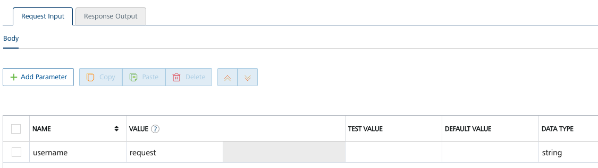

# Validate input

Input parameters should be mapped in the **Request Input** section of the operation. They can be accessed via `VoltMxRequest.getInputParam()`.



If a request parameter was passed to Foundry but not explicitly mapped in the integration service, it is still available in `VoltMxRequest.getRequestParam()`. Certain Volt MX Foundry parameters are also passed, for example the current service and app.

Header parameters are also available via `VoltMxRequest.getHeaderParam()`.

The following code can be used to validate a username parameter in a VoltScript preprocessor and throw an error if blank.

``` vbscript linenums="1"
Dim username as String
username = VoltMxRequest.getInputParam("username")
If (username = "") Then
    Call VoltMxResult.setErrorMessage("Username is required")
    Return False
End If
```

!!! note
    `getInputParam()` returns an empty string if no parameter with the corresponding name can be found.

!!! note
    For a VoltScript integration service or postprocessor, change line 5 from `Return False` to `Return`.