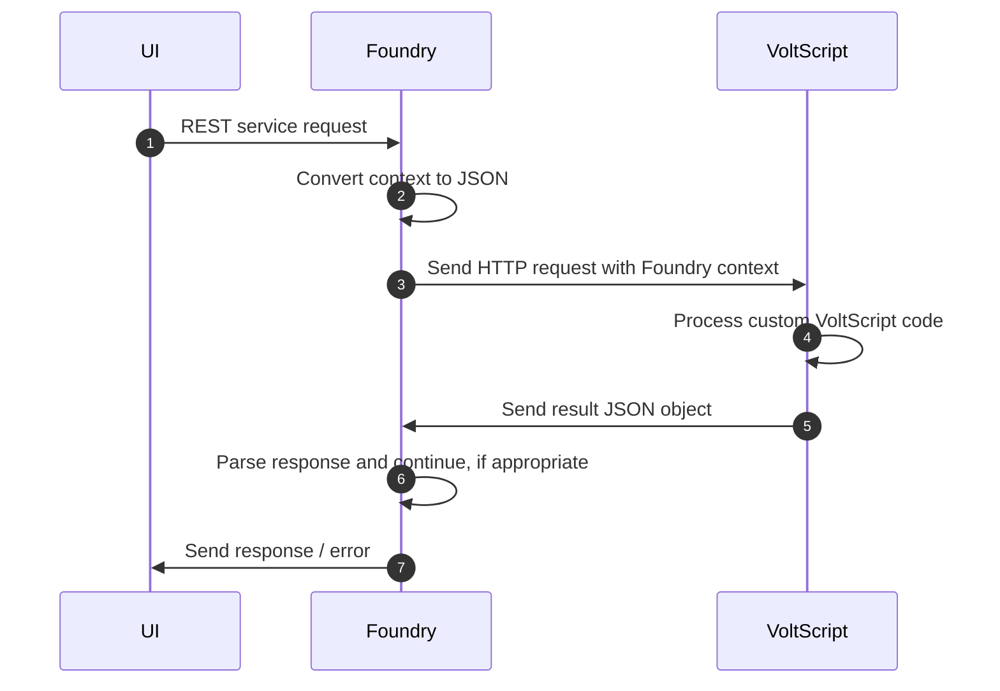
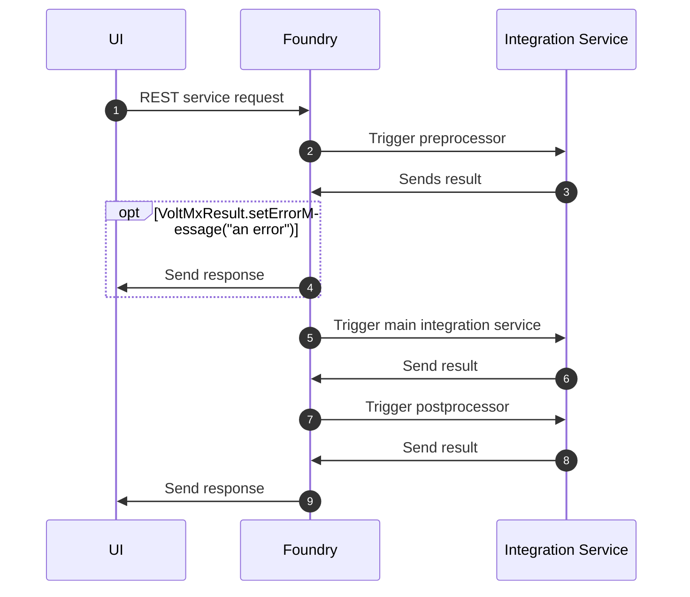

# Foundry processing

Foundry sends HTTP requests across to the VoltScript runtime for processing. The approach is the same for preprocessors, integration services and postprocessors.

!!! note
    Preprocessors and postprocessors cannot be added to a VoltScript Integration Service in Foundry. Instead, add the relevant validation or manipulation in the main VoltScript Integration Service code. This will minimize the processing time.

If `VoltMxResult.setErrorMessage()` is called, an error is returned from the Integration Service and no further steps in the process will be performed. So the processing is:

