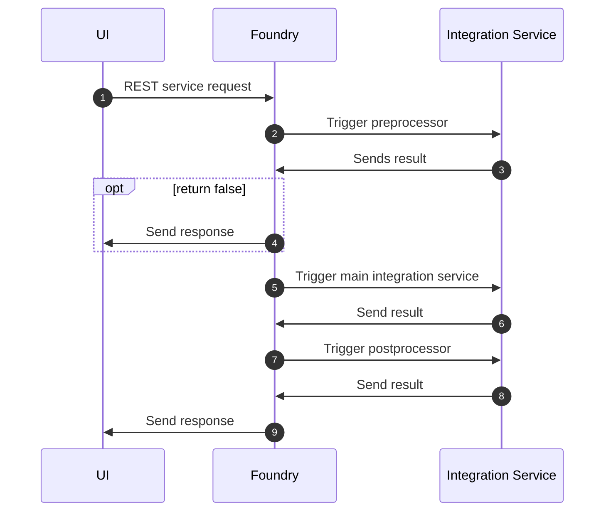

# Foundry processing

Foundry sends HTTP requests across to the VoltScript runtime for processing. The approach is the same for preprocessors, integration services and postprocessors.

--8<-- "prepost.md"

For a preprocessor, if the code ends with `return false`, an abort signal is sent back to Foundry in the `VoltMXResult`. On finding that, Foundry aborts the integration service and no further steps in the process will be performed. So the processing is:

